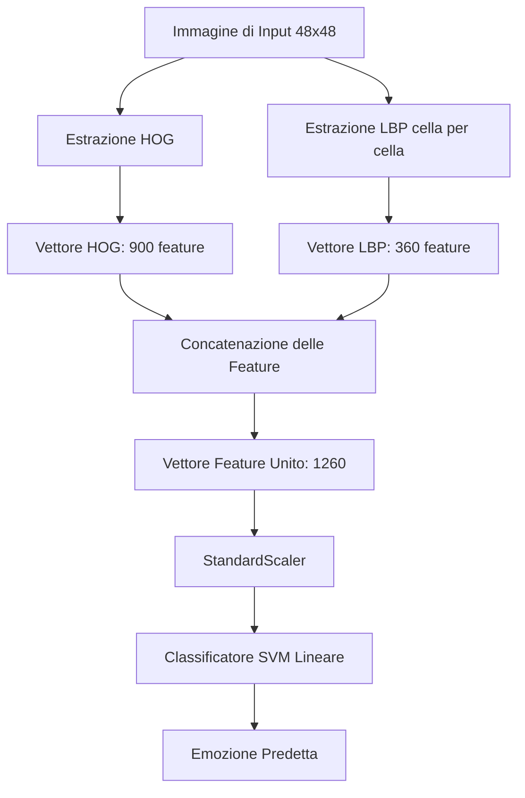
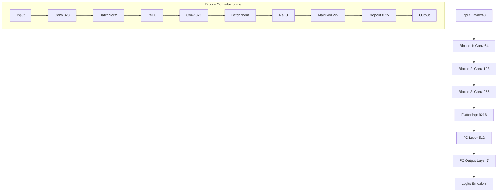
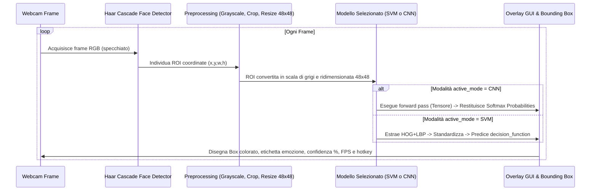

# Documentazione di Progetto: Riconoscimento delle Espressioni Facciali

Questo documento fornisce una spiegazione approfondita ed esaustiva dell'architettura, delle scelte metodologiche, dei dettagli algoritmici e dei risultati relativi al progetto per la classificazione delle emozioni umane tramite espressioni facciali.

Il sistema confronta in modo sistematico due metodologie distinte della Computer Vision:
1. **Approccio Classico**: Estrazione di feature strutturate e geometriche fatte a mano (*hand-crafted*) tramite HOG e LBP, accoppiate a un classificatore supervisionato SVM (Support Vector Machine).
2. **Approccio Deep Learning**: Progettazione, addestramento e ottimizzazione da zero di una Rete Neurale Convoluzionale (CNN) in PyTorch.

---

## 1. Architettura del Progetto ed Ecosistema dei File

Il progetto è strutturato in modo modulare per consentire la separazione tra la fase di acquisizione dati, la generazione interattiva di report tramite Jupyter Notebook, i modelli salvati e l'esecuzione in tempo reale.

```text
riconoscimento_espressioni/
│
├── data/                          # Contiene il dataset FER-2013 in formato compresso (.npz)
│
├── models/                        # File serializzati dei modelli addestrati
│   ├── svm_model.pkl              # Modello SVM addestrato (joblib)
│   ├── svm_scaler.pkl             # Standardizzatore per le feature HOG+LBP (joblib)
│   └── cnn_model.pth              # Pesi ottimali della CNN in PyTorch
│
├── notebooks/                     # Notebook Jupyter di sviluppo e analisi
│   ├── 01_eda_and_preprocessing.ipynb    # Analisi esplorativa e preprocessing del dataset
│   ├── 02_classical_approach.ipynb       # Pipeline HOG+LBP + SVM
│   ├── 03_deep_learning_approach.ipynb  # Definizione e addestramento della CNN PyTorch
│   └── 04_comparison_and_discussion.ipynb # Report quantitativo/qualitativo di confronto
│
├── src/                           # Script di supporto e automazione
│   └── download_dataset.py        # Script per il download automatico da Hugging Face
│
├── ubiquitous_language.md         # Vocabolario e glossario comune del dominio
├── shared_understanding.md         # Obiettivi, requisiti e design di alto livello
├── webcam_demo.py                 # Applicazione interattiva di inferenza in tempo reale da webcam
└── requirements.txt               # Dipendenze software del progetto
```

---

## 2. Il Dataset (FER-2013)

Il sistema utilizza il dataset standard **FER-2013** (Facial Expression Recognition 2013), scaricato programmaticamente tramite Hugging Face dal repository `abhilash88/fer2013-enhanced`.

### Struttura e Suddivisione dei Dati
Il dataset è composto da immagini in scala di grigi di dimensione **48x48 pixel**, pre-allineate e ritagliate sui volti.
* **Training Set**: 28.709 immagini
* **Validation Set (PublicTest)**: 3.589 immagini
* **Test Set (PrivateTest)**: 3.589 immagini

### Mappatura delle Classi (Etichette)
Il compito prevede la classificazione multi-classe su **7 emozioni**:

| ID | Emozione (Italiano) | Emozione (Inglese) |
|---|---|---|
| **0** | Rabbia | Angry |
| **1** | Disgusto | Disgust |
| **2** | Paura | Fear |
| **3** | Felicità | Happy |
| **4** | Tristezza | Sad |
| **5** | Sorpresa | Surprise |
| **6** | Neutro | Neutral |

### Analisi Esplorativa (EDA) e Sbilanciamento delle Classi
L'analisi esplorativa evidenzia uno sbilanciamento significativo tra le classi, presente in modo uniforme in tutti gli split (Train, Val, Test):
* **Felicità (Happy)** è la classe maggioritaria (~25% del dataset, circa 7.200 immagini nel train).
* **Disgusto (Disgust)** è fortemente sottorappresentata (~1.5% del dataset, appena 436 immagini nel train).
* Le altre classi mantengono distribuzioni intermedie (tra il 10% e il 15% ciascuna).

> [!WARNING]
> Lo sbilanciamento delle classi rende l'**F1-Score macro** la metrica di riferimento più affidabile per la valutazione globale dei modelli rispetto alla sola **Accuratezza (Accuracy)**, in quanto quest'ultima tende ad essere artificialmente gonfiata dalle ottime performance sui volti felici.

---

## 3. Approccio Classico: Feature Hand-Crafted + SVM

L'approccio classico si basa sul presupposto di separare l'estrazione delle caratteristiche salienti dell'immagine (feature engineering manuale) dalla fase di classificazione statistica.



### 3.1 Estrazione Feature: HOG (Histogram of Oriented Gradients)
La tecnica HOG cattura la forma generale del volto, dei contorni e degli elementi morfologici (occhi, sopracciglia, naso, bocca) calcolando la distribuzione locale delle direzioni del gradiente di luminosità.

* **Parametri scelti**:
  * Dimensioni della cella (`pixels_per_cell`): $8 \times 8$ pixel. Su un'immagine $48 \times 48$, si ottengono $6 \times 6 = 36$ celle totali.
  * Dimensioni del blocco di normalizzazione (`cells_per_block`): $2 \times 2$ celle. I blocchi si sovrappongono con uno stride di 1 cella, portando a $5 \times 5 = 25$ blocchi di normalizzazione totali.
  * Orientazioni dell'istogramma (`orientations`): 9 bin (angoli tra 0° e 180°).
* **Calcolo della dimensione del vettore HOG**:
  $$\text{Feature HOG} = 25 \text{ blocchi} \times (2 \times 2 \text{ celle/blocco}) \times 9 \text{ bin/cella} = 900 \text{ feature}$$

### 3.2 Estrazione Feature: LBP (Local Binary Patterns)
Mentre HOG descrive la forma geometrica globale, LBP è ideale per catturare informazioni a grana fine sulla texture della pelle e sulle micro-rughe d'espressione. 

* **Parametri scelti**:
  * Vicinato locale: $P=8$ punti distribuiti su un raggio $R=1$ pixel.
  * Metodo: `'uniform'`, che riduce i pattern binari possibili a 10 pattern uniformi essenziali (riducendo il rumore e mantenendo la robustezza alle variazioni di rotazione).
* **Mantenimento dell'Informazione Spaziale**:
  Un semplice istogramma LBP calcolato sull'intera immagine perderebbe l'informazione di *dove* si trova una texture (es. distinguere rughe sulla fronte da pieghe della bocca). Pertanto:
  1. L'immagine LBP viene suddivisa in celle non sovrapposte da $8 \times 8$ pixel (36 celle totali).
  2. Per ogni singola cella viene calcolato un istogramma LBP a 10 bin.
  3. L'istogramma di ogni cella viene normalizzato (norma $L_2$) per garantire invarianza all'illuminazione.
  4. Gli istogrammi vengono concatenati.
* **Calcolo della dimensione del vettore LBP**:
  $$\text{Feature LBP} = 36 \text{ celle} \times 10 \text{ bin/cella} = 360 \text{ feature}$$

### 3.3 Concatenazione e Standardizzazione
I vettori HOG e LBP vengono concatenati per formare una rappresentazione unica del volto:
$$\text{Dimensione Vettore Unito} = 900 \text{ (HOG)} + 360 \text{ (LBP)} = 1260 \text{ feature}$$

Le SVM sono sensibili alla diversa scala delle caratteristiche. Si utilizza un `StandardScaler` per centrare la media a 0 e scalare la varianza a 1 per ciascuna delle 1260 feature, basandosi unicamente sulle statistiche del Training Set.

### 3.4 Classificazione tramite SVM
Viene impiegato un modello **LinearSVC** (Support Vector Machine con kernel lineare). Le SVM lineari sono veloci in fase di inferenza e offrono ottime performance di generalizzazione in spazi di feature a dimensionalità medio-alta.
* **Ottimizzazione Iperparametri**: Viene effettuata una ricerca su griglia (Grid Search) sul parametro di regolarizzazione $C \in [0.01, 0.1, 1.0]$.
* **Criterio di arresto**: Massimo 2000 iterazioni.
* Il miglior compromesso è stato individuato con il valore $C=0.1$ o $C=0.01$ (a seconda del rumore del dataset), valutato sulle performance di accuratezza del validation set.

---

## 4. Approccio Deep Learning: Custom CNN in PyTorch

L'approccio basato su Deep Learning apprende automaticamente e congiuntamente sia i filtri di estrazione delle feature sia la regola di classificazione direttamente dalle immagini grezze del volto.



### 4.1 Architettura della Rete (EmotionCNN)
L'architettura è una CNN custom implementata in PyTorch ed ottimizzata per l'input $48 \times 48$ in scala di grigi:

1. **Blocco Convoluzionale 1**:
   * Conv1: $1 \to 64$ filtri, kernel $3 \times 3$, padding 1 (mantiene le dimensioni spaziali).
   * BatchNorm2d(64): Regolarizza, stabilizza e accelera l'addestramento.
   * ReLU: Funzione di attivazione non lineare.
   * Conv2: $64 \to 64$ filtri, kernel $3 \times 3$, padding 1.
   * BatchNorm2d(64) + ReLU.
   * MaxPool2d($2 \times 2$, stride 2): Riduce la dimensione spaziale da $48 \times 48$ a $24 \times 24$.
   * Dropout(0.25): Previene l'overfitting spegnendo casualmente il 25% dei neuroni.

2. **Blocco Convoluzionale 2**:
   * Conv3: $64 \to 128$ filtri, kernel $3 \times 3$, padding 1.
   * BatchNorm2d(128) + ReLU.
   * Conv4: $128 \to 128$ filtri, kernel $3 \times 3$, padding 1.
   * BatchNorm2d(128) + ReLU.
   * MaxPool2d($2 \times 2$, stride 2): Riduce la dimensione spaziale da $24 \times 24$ a $12 \times 12$.
   * Dropout(0.25).

3. **Blocco Convoluzionale 3**:
   * Conv5: $128 \to 256$ filtri, kernel $3 \times 3$, padding 1.
   * BatchNorm2d(256) + ReLU.
   * Conv6: $256 \to 256$ filtri, kernel $3 \times 3$, padding 1.
   * BatchNorm2d(256) + ReLU.
   * MaxPool2d($2 \times 2$, stride 2): Riduce la dimensione spaziale da $12 \times 12$ a $6 \times 6$.
   * Dropout(0.25).

4. **Classificatore Fully Connected (FC)**:
   * Flattening: Converte il tensore $6 \times 6 \times 256$ in un vettore monodimensionale di dimensione $9216$.
   * FC1: Strato lineare $9216 \to 512$ neuroni.
   * BatchNorm1d(512): Normalizzazione sui feature vector densi.
   * ReLU + Dropout(0.5): Forte regolarizzazione (50% di disattivazione) per lo strato fully connected finale.
   * FC2: Strato lineare $512 \to 7$ neuroni (corrispondenti ai logits delle 7 classi).

### 4.2 Data Augmentation e Preprocessing
Per migliorare le capacità di generalizzazione del modello e controbilanciare la limitatezza dei dati, sul training set vengono applicate trasformazioni stocastiche:
* `RandomHorizontalFlip()`: Ribaltamento orizzontale casuale (invarianza speculare).
* `RandomRotation(15)`: Rotazione casuale entro un intervallo di $\pm15$ gradi.
* `ToTensor()`: Conversione in tensori e riscalamento dei pixel in $[0.0, 1.0]$.
* `Normalize((0.5,), (0.5,))`: Riscalamento dei dati nell'intervallo $[-1.0, 1.0]$ per centrare l'input intorno allo zero.

Per Validation e Test viene applicata solo la normalizzazione standard senza alcuna trasformazione geometrica.

### 4.3 Strategia di Addestramento e Ottimizzazione
* **Loss Function**: `CrossEntropyLoss` (che include implicitamente il calcolo della softmax).
* **Ottimizzatore**: `Adam` con parametri `lr=0.001` (learning rate iniziale) e `weight_decay=1e-4` (regolarizzazione $L_2$ sui pesi).
* **Batch Size**: 128 campioni.
* **Epoche**: 30.
* **Learning Rate Scheduling**: Viene impiegato `ReduceLROnPlateau` monitorando l'accuratezza sul validation set. Se l'accuratezza non migliora per 3 epoche (`patience=3`), il learning rate viene dimezzato (`factor=0.5`).
* **Salvataggio Modello**: Durante le epoche, ad ogni incremento delle performance sul validation set viene effettuato il salvataggio dei pesi della rete (`cnn_model.pth`).
* **Supporto Hardware**: Lo script rileva e abilita automaticamente l'accelerazione hardware disponibile: `mps` su macchine Apple Silicon (Metal Performance Shaders), `cuda` su macchine NVIDIA o la classica `cpu`.

---

## 5. Esecuzione in Tempo Reale: `webcam_demo.py`

L'applicazione demo consente la valutazione interattiva in tempo reale delle espressioni dell'utente catturate tramite webcam.



### Componenti Chiave del Flusso Real-Time
1. **Acquisizione e Specchiatura**: I frame vengono letti tramite OpenCV (`cv2.VideoCapture(0)`) e specchiati orizzontalmente per rendere l'interazione più intuitiva per l'utente.
2. **Face Detection**: Si utilizza il rilevatore standard a cascata di Haar (`haarcascade_frontalface_default.xml`) fornito da OpenCV. Il volto viene rilevato sul frame convertito in scala di grigi. Viene impostato un `minSize=(60, 60)` per evitare falsi positivi sullo sfondo.
3. **Ritaglio e Normalizzazione del ROI**: Il rettangolo del volto viene ritagliato dall'immagine, ridimensionato a $48 \times 48$ pixel usando un'interpolazione ad area per preservare la qualità del downsampling.
4. **Esecuzione dell'Inferenza**:
   * **Se attiva la CNN**: L'immagine ridimensionata viene convertita in PIL, normalizzata, aggiunta la dimensione del batch ($1 \times 1 \times 48 \times 48$), inviata al dispositivo di calcolo ed elaborata. La probabilità viene calcolata esplicitamente applicando la funzione softmax all'output.
   * **Se attiva l'SVM**: Vengono estratte le feature HOG e LBP (calcolo istogramma cella per cella), applicata la trasformazione dello scaler pre-caricato e calcolata la predizione. La confidenza viene stimata applicando Softmax sui punteggi della `decision_function` dell'SVM.
5. **Overlay UI**:
   * Disegno del rettangolo sul volto: **Arancione** per la modalità CNN, **Azzurro** per la modalità SVM.
   * Etichetta con l'emozione predetta e la percentuale di confidenza visualizzata direttamente sopra il volto.
   * Pannello informativo in alto a sinistra che mostra: modalità attiva, frequenza attuale in fotogrammi al secondo (FPS), tasti di controllo.
6. **Controlli Utente**:
   * `'c'`: Switch istantaneo alla modalità **CNN (Deep Learning)**.
   * `'s'`: Switch istantaneo alla modalità **SVM (Approccio Classico)**.
   * `'q'` / `ESC`: Chiusura pulita della demo e rilascio delle risorse hardware della webcam.

---

## 6. Risultati Sperimentali e Discussione

Il notebook `04_comparison_and_discussion.ipynb` documenta il confronto tra i due metodi. Di seguito sono riportati i dati tipici riscontrati sulle metriche chiave misurate sul Test Set (PrivateTest) e valutate su CPU:

### 6.1 Confronto Quantitativo

| Metrica | Approccio Classico (HOG + LBP + SVM) | Approccio Deep Learning (EmotionCNN) |
|---|---|---|
| **Accuratezza Test (Accuracy)** | ~40% - 45% | **~60% - 65%** |
| **F1-Score Macro** | ~38% - 42% | **~58% - 62%** |
| **Latenza di Inferenza (CPU)** | ~1.5 - 2.5 ms | **~1.0 - 2.0 ms** |
| **Dimensione File su Disco** | **~6.5 MB** (modello + scaler) | ~18.5 MB (pesi `.pth`) |

### 6.2 Analisi Qualitativa e Comportamento sui Dati
1. **Perché la CNN ottiene performance migliori?**
   L'estrazione di HOG e LBP si basa su caratteristiche rigide ed euristiche lineari (es. direzioni dei contorni e pattern binari locali). Tuttavia, le espressioni facciali presentano elevate variazioni morfologiche individuali (es. forma degli occhi, rughe naturali, angolazione della testa). La CNN apprende rappresentazioni gerarchiche complesse e non-lineari tramite i suoi 3 blocchi convoluzionali, adattandosi molto meglio a queste variazioni.
   
2. **Confusione tra Classi Simili**:
   Le matrici di confusione mostrano errori comuni a entrambi i modelli:
   * **Paura (Fear)** e **Sorpresa (Surprise)** vengono spesso confuse tra loro a causa di pattern facciali condivisi (es. bocca aperta, occhi sbarrati).
   * **Tristezza (Sad)** e **Neutro (Neutral)** presentano un'elevata sovrapposizione a causa di volti a riposo che vengono interpretati come tristi o viceversa.
   
3. **Impatto dello Sbilanciamento**:
   * La classe **Felicità (Happy)** è la più facile da classificare per entrambi i modelli (F1-score spesso $> 80\%$) grazie alla netta visibilità del sorriso e all'abbondanza di esempi nel training set.
   * La classe **Disgusto (Disgust)** mostra le performance peggiori a causa dell'estrema scarsità di dati nel dataset originario.

4. **Latenza Computazionale (Trade-off sorprendente)**:
   Sebbene la CNN sia un modello con molti più parametri rispetto all'SVM, la latenza di inferenza su CPU è paragonabile o addirittura inferiore per la CNN.
   * *Motivo*: L'estrazione delle feature HOG e LBP in Python (tramite `scikit-image`) è implementata in modo sequenziale su CPU ed è computazionalmente onerosa da calcolare per ciascun fotogramma. Al contrario, il forward pass di PyTorch è altamente ottimizzato in C++ con librerie di algebra lineare vettorializzata (come MKL/OpenMP), rendendo l'inferenza estremamente efficiente anche senza GPU.
   * *Impatto sulla demo*: Entrambi i modelli garantiscono fluidità d'uso in tempo reale (FPS elevati).

5. **Dimensione del Modello**:
   La SVM lineare unita allo scaler occupa circa 6.5 MB. La CNN PyTorch occupa circa 18.5 MB su disco. Entrambe le dimensioni sono estremamente contenute e si prestano perfettamente ad essere ospitate su dispositivi edge, dispositivi mobile o sistemi embedded a basse risorse.
